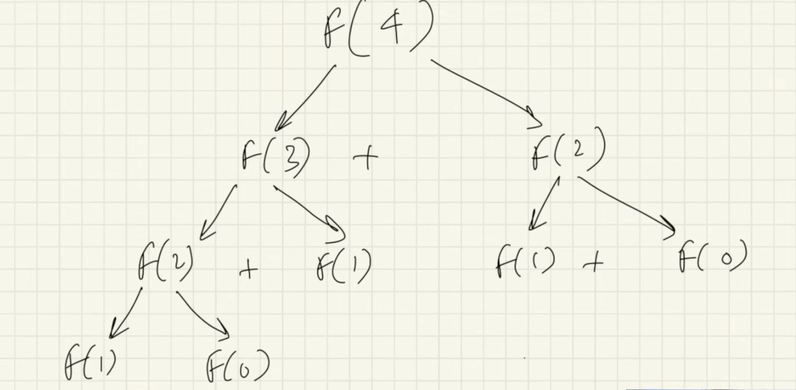

# What is recursion?
It is a programming and problem - solving technique where a function calls itself inside it's own code to solve a smaller peice of the same problem. It should has a base case : the stopping condition that tells the function when to stop itself, preventing infinite loops and crashs.
* why Base case is imp? \
If we didn't provide base condition it give stack overflow error cause even in recursion every call get place in stack memory until it stop calling new functions and  get back to the place where it was initially called
# Some basics About function
* While the function is not finished executing it will remain in the stack memory 
* when function finishes executing it's removed from the stack memory & the flow of code is returned where the function is initially called.
# Why recursion?
It helps us in solving bigger complex problems in a simple way. \
You can convert the recursion solution into iteration and vice versa. \
Space complexity is not constand because of recursive calls. \
You can visualise it using recursive tree.
# Q1 : Fibonacci Number 
Recurrance relation : **fibo(n)=fibo(n-1)+fibo(n-2)** \
Every nth term is the sum of it's last two elements.

Base condition fibo(1)=1 and fibo(0)=0 \
Fibo function in first.java \
Tail recursion is a specific type of recursion where the recursive call is the absolute last operation performed by the function. But in the fibo series the calling is not the tail recursion cause the last step of the function is to add and return the result. But it we look to print 5 no. then in that the print statement is called as the Tail recursion since it's not doing anything else in the last just calling itself.

# How to solve recusive problems :
* Idendtify if you can break down function in smaller problems
* Write the recursive relatation if needed.
* Draw the recursive tree
* About the tree :
    * See the flow of functions, How they are getting in stack.
    * Identitfy and focus on left tree calls and right tree calls (since the left tree calls execute first)
    * Draw the tree and pointer again and again using pen and paper also use a debugger to see the flow.
* See how the values are return at each step, See where the function call come out, In the end you will come out of to the main function.

# Understanding Variables 
Understanding what and where to use which datatype is very essential in learning recursion.
* Arguments data type 
* Return data type
* body of func data type

# Q2 : Binary Search 
Recurance relation : F(n) = O(1) + F(n/2) \
In this first term denotes the comparison and seocnd denote the division of array in two part.

# Types of recurrance relation 
* Linear recurrence relation - fibonaccie series
    * these are not practical for even number like 50-100.
    * It does repeated function calls - (solved by DP)
* Divide and conqure recurrence - binary search
    * reduce by a factor so can work for bigger numbers.

